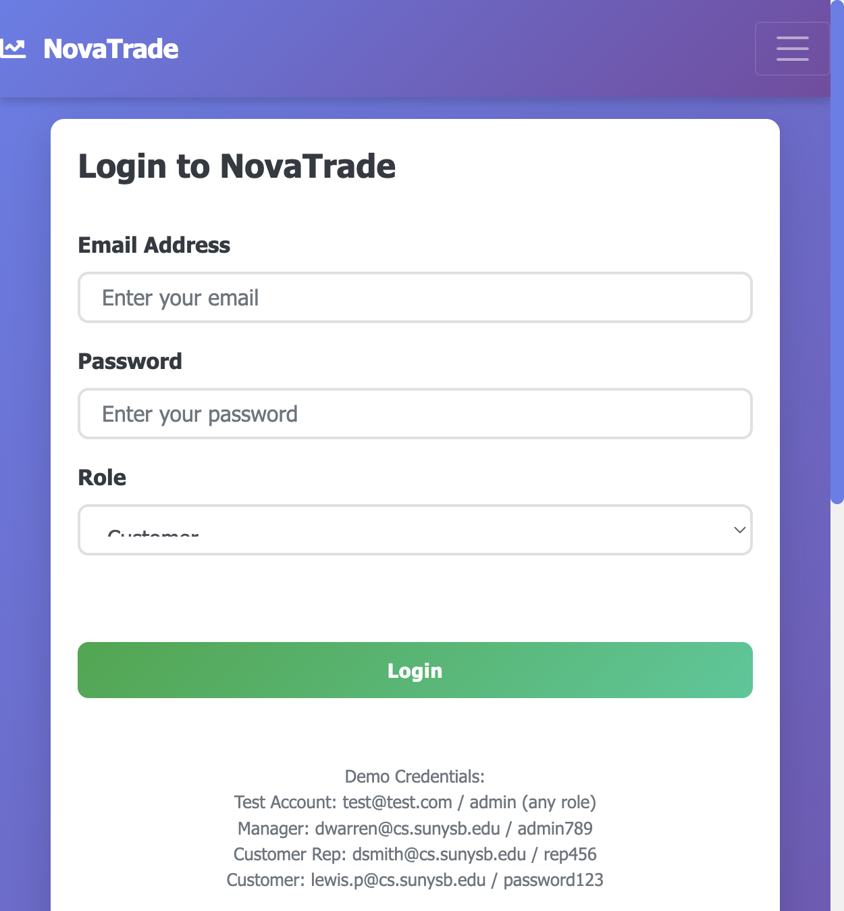
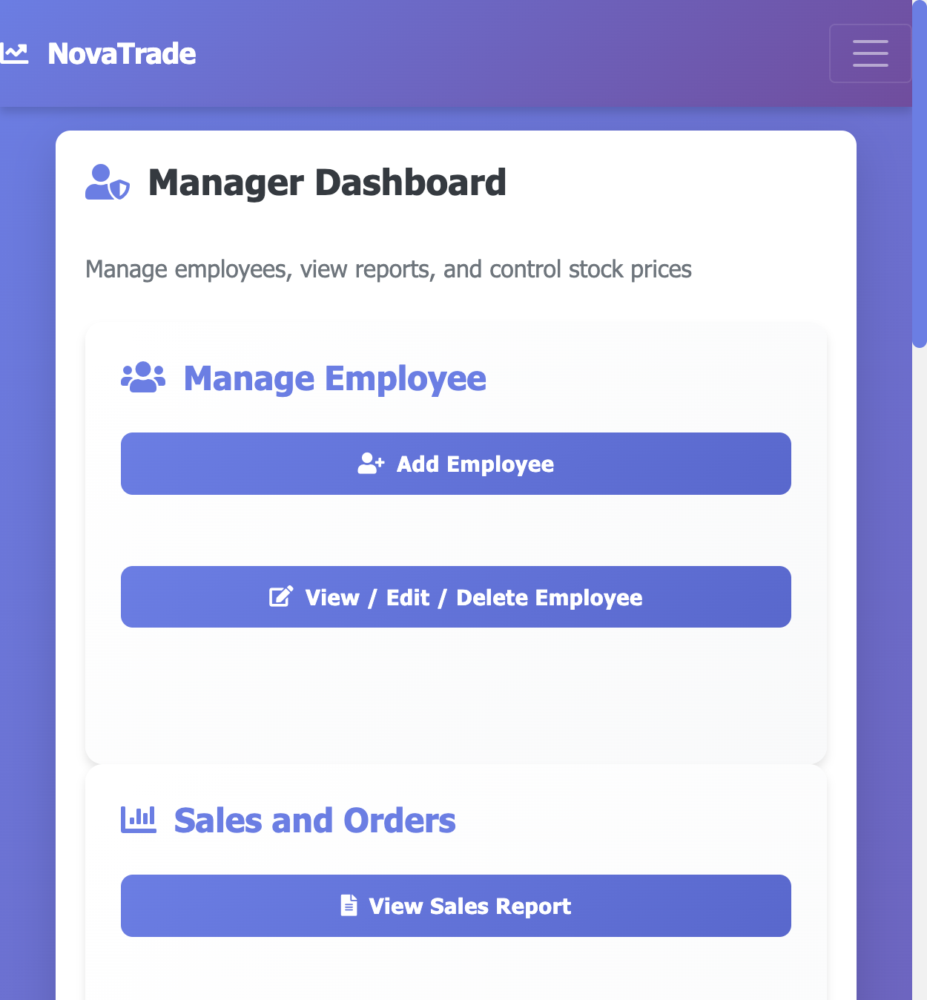
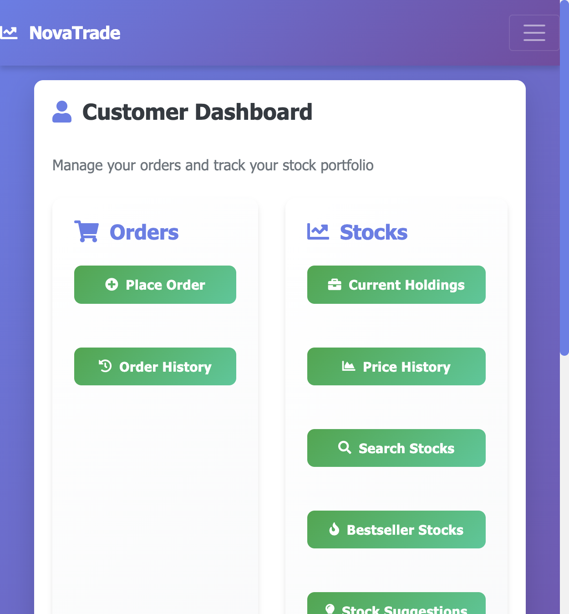
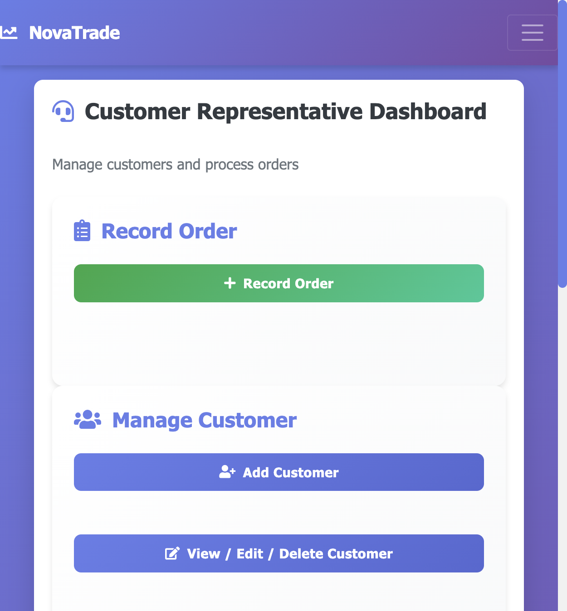

# NovaTrade

**A full-stack stock trading platform with role-based access control — built with Java Servlets, JSP, and MySQL.**

[](http://129.158.38.59/)
[](https://github.com/cdandeniya/stock-trader)

> **Try it live:** [http://129.158.38.59/](http://129.158.38.59/)  
> **Quick demo login:** `test@test.com` / `admin` (select any role)

---

## Overview

NovaTrade simulates a brokerage operations platform where **customers**, **customer representatives**, and **managers** each get a dedicated workflow. The app demonstrates enterprise-style patterns: MVC layering, DAO data access, session-based auth, and a MySQL-backed domain model for trading, reporting, and administration.

<p align="center">
  
  <br/>
  <em>Login with role-based routing to the correct dashboard</em>
</p>

---

## Platform Screenshots

### Manager — operations & analytics
Employee management, sales reports, revenue summaries, and stock price administration.

<p align="center">
  
</p>

### Customer — trading & portfolio
Place orders, view history, track holdings, search stocks, and get suggestions.

<p align="center">
  
</p>

### Customer representative — client services
Record orders, manage customer records, and access mailing lists.

<p align="center">
  
</p>

---

## Key Features

| Area | Capabilities |
|------|----------------|
| **Authentication** | Session-based login with role selection (Manager, Customer Rep, Customer) |
| **Trading** | Market, trailing stop, and hidden stop orders |
| **Portfolio** | Holdings, price history, bestsellers, stock suggestions |
| **Administration** | Employee CRUD, customer management, stock price updates |
| **Analytics** | Sales reports, revenue summaries, top employee/customer by revenue |
| **UI** | Responsive Bootstrap layout with role-specific dashboards |

---

## Tech Stack

| Layer | Technologies |
|-------|----------------|
| **Backend** | Java 8, Java Servlets, JSP |
| **Database** | MySQL 8 |
| **Frontend** | HTML5, CSS3, JavaScript, Bootstrap 4, jQuery |
| **Build** | Maven |
| **Server** | Apache Tomcat 8.5 |
| **Deployment** | Docker, Docker Compose, Oracle Cloud (Always Free) |

---

## Architecture

```
src/main/java/com/stocktrader/
├── controller/   # HTTP request handling (Servlets)
├── service/      # Business logic
├── repository/   # DAO pattern — database access
├── model/        # Domain entities
└── config/       # Database configuration (env-aware)

src/main/webapp/
├── WEB-INF/views/   # Role-specific JSP views
└── static/          # CSS, JavaScript, assets
```

---

## Demo Credentials

| Role | Email | Password |
|------|-------|----------|
| **Any role (quick demo)** | `test@test.com` | `admin` |
| Manager | `dwarren@cs.sunysb.edu` | `admin789` |
| Customer rep | `dsmith@cs.sunysb.edu` | `rep456` |
| Customer | `lewis.p@cs.sunysb.edu` | `password123` |

> Database-backed accounts require the MySQL schema and seed data (see setup below).

---

## Local Development

### Prerequisites
- Java 8+
- Maven 3.6+
- MySQL 5.7+ or 8.0+

### Setup

```bash
git clone https://github.com/cdandeniya/stock-trader.git
cd stock-trader/stock-trader

# Initialize database
mysql -u root -p < src/main/resources/sql/BETTERSCRIPT.sql
mysql -u root -p < src/main/resources/sql/basevalues.sql

# Build and run (Tomcat Maven plugin)
mvn clean package
mvn tomcat7:run
```

Open [http://localhost:8080/stock-trader/](http://localhost:8080/stock-trader/)

Environment variables (`DB_URL`, `DB_USER`, `DB_PASSWORD`, or `DATABASE_URL`) override defaults in `DatabaseConfig.java` for production.

---

## Deployment (Docker)

Production-style deploy with Tomcat + MySQL:

```bash
cp .env.example .env   # set strong passwords
docker compose up -d --build
```

App is served at `http://localhost/` (port 80). See `DEPLOYMENT.md` and `docker-compose.yml` for Oracle Cloud VM hosting.

---

## Database Schema

Core tables: `Customers`, `Employee`, `Manager`, `CustomerRep`, `Stock`, `Account`, `StockOrder`, `Location`, and `login`.

Scripts: `src/main/resources/sql/BETTERSCRIPT.sql`, `basevalues.sql`

---

## Security

- Session-based authentication with role checks in controllers
- Parameterized SQL (prepared statements) to mitigate injection
- Server-side input validation on forms
- Environment-based database credentials (no hardcoded production secrets)

---

## Links

- **Live demo:** [http://129.158.38.59/](http://129.158.38.59/)
- **Repository:** [github.com/cdandeniya/stock-trader](https://github.com/cdandeniya/stock-trader)

---

**Built with Java, Servlets, JSP, MySQL, Bootstrap, and Docker**
